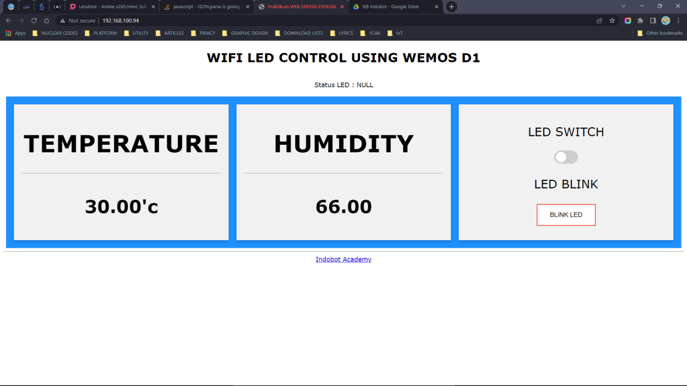

# Controlling LED and Monitoring Temp&Hum using web-base local server on ESP8266

controlling led and monitoring temp and hum using web-based local server on esp8266, this can be used without internet connections, just need WLAN from your router or somewhere else

## All We Need
  1. DHT11 and its library, for monitoring temperature and humidity
  2. LED, for testing we can change it with relay or other output device

## Interface
  Of course, you can change theinterface as you want, if you know more about html css and javascript
  
